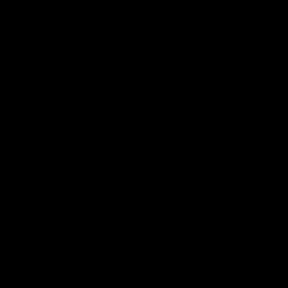
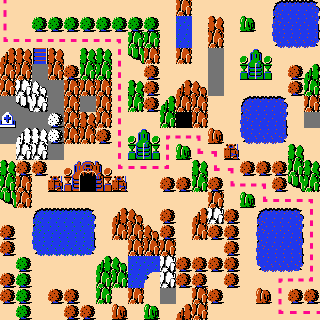
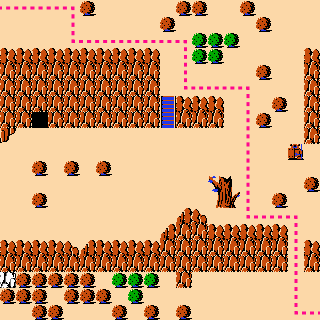
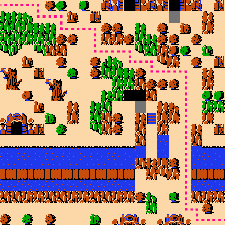

<p align="center">
	
</p>
<p align="center">
	
	
	
</p>

# You Only Randomize Once

Code for the paper _You Only Randomize Once: Shaping Statistical Properties in Constraint-based PCG_. 

Essentially, You Only Randomize Once (YORO) is a new technique that allows controlling the statistics of the outputs generated
by a constraint solver. We apply it to generating [WaveFunctionCollapse](https://github.com/mxgmn/WaveFunctionCollapse)-style tilemaps using a constraint solver, making it possible to add global constraints like path reachability. (In theory, YORO could be used in constraint solving setting and is not limited to PCG.)

If you use this code, please cite the paper as follows:

```
@misc{katz2024yoro,
    title={You Only Randomize Once: Shaping Statistical Properties in Constraint-based PCG},
    author={Jediah Katz and Bahar Bateni and Adam Smith},
    year={2024}
}
```

## Installation

- Make sure you have Python installed, and clone this repo.
- I recommend using the package/env manager [poetry](https://python-poetry.org/docs/). Just run `poetry install` to install all Python dependencies. 
    - If you're not using poetry, you can do `pip install -r requirements.txt`.
- (Optional) Install the Clasp SAT solver if you'd like to use it. You can find installation instructions [here](https://potassco.org/doc/start/), but on MacOS you can just do `brew install clasp`.

## Usage
If you're using poetry, run `poetry shell` to enter into the virtual environment with the dependencies installed. Then, you can run the script with the following command:

```
python3 src/main.py
```

To write the generated output to a file instead of viewing it in a new window, you can run:

```
python3 src/main.py --output out.png
```

### CLI Parameters

There are a number available presets to help you get started. You can use them as follows:

```
python3 src/main.py --preset zelda-tile-freq
```

| Preset                    | Description |
| ------------------------- | ----------- |
| `zelda-tile-freq`         | Default. Generates 20x20 Zelda map outputs with a dirt tile path from (0, 0) to (N-1, N-1) that moves only right and down. Controls the frequency of tiles in the output to resemble the input map. |
| `zelda-neighborhood-freq` | Generates 20x20 Zelda map outputs with a dirt tile path from (0, 0) to (N-1, N-1) that moves only right and down. Controls the frequency of _neighborhoods_ in the output to resemble the input map, based on [Bateni et al., 2023](https://dl.acm.org/doi/pdf/10.1145/3582437.3582441).
| `zelda-no-yoro`           | Generates 20x20 Zelda map outputs with a dirt tile path from (0, 0) to (N-1, N-1) that moves only right and down. Does not control the output statistics, leading to a poor-resemblance output with mostly bricks. |
| `mario`                   | Generates a 20x20 Mario map output. Controls the frequency of tiles in the output to resemble the input map. |
| `bw-uniform`              | Generates a 20x20 output with only two colors (black and white) and no adjacency constraints. Controls the frequency of tiles in the output to be 50/50 between black and white.
| `bw-tile-freq`            | Generates a 20x20 output with only two colors (black and white) and no adjacency constraints. Controls the frequency of tiles in the output to resemble the frequency of the input image (which has 3 white tiles out of 49 total).

   

The full list of presets and the configurations they represent can be found [here](https://github.com/jediahkatz/you-only-randomize-once/blob/2aa658e2a30f482aca7f5359d236feeafe971042/arguments.py#L98).

For more granular control, you can override the presets with individual configuration settings. For example, suppose you want to generate 15x15 Zelda maps, with a global path that can move in any direction instead of just right and down, and using the OR-Tools solver instead of PicoSAT. Then you could do:
```
python3 src/main.py --preset zelda --n 15 --global_constraint path_all_directions --solver ortools
```

Here are some of the most notable options:

| Option                    | Description |
| ------------------------- | ----------- |
| `n`                       | The size of generated outputs (N x N). Defaults to 20. Non-square outputs are not currently supported. |
| `seed`                    | Specifies a random seed for generating the YORO variable ordering, for reproducibility. |
| `output`                  | The filepath to save the generated output to as a PNG. If not specified, the image will be opened in a new window.
| `solver`                  | Choose between `picosat`, `ortools`, or `clasp` solver backends.
| `var_ordering`            | How the YORO method should order the solver's variables to control output statistics. Options are `trivial` (don't use YORO), `uniform` (every tile is equally likely), `tile_frequency` (tiles are selected with the likelihood that they appear in the input). For the Zelda map only, if `--encoding=neighborhood` is set, then you can also specify `context_sensitive` (neighborhoods are selected with the likelihood that they appear in the input). 
| `path-constraint`         | (For the Zelda map only) whether to add a global constraint that there must be a path from (0, 0) to (N-1, N-1). Can be `none` (no path), `path_right_down` (a path that can only move right and down), and `path_all_directions` (a path that can double back on itself).


The full list of configuration options can be found [here](https://github.com/jediahkatz/you-only-randomize-once/blob/2aa658e2a30f482aca7f5359d236feeafe971042/arguments.py#L115).

## Code structure

### `main.py`
Entry point and high-level procedure of WaveFunctionCollapse with YORO.

### `arguments.py`
Uses `argparse` to parse the user's command line options. Specifies all presets and options.

### `input_grids.py`
Defines functions to load input grids from a URL or from a file. Also defines "black and white" inputs programmatically.

### `encode_wfc.py`
Implements all constraints for the encoding of WaveFunctionCollapse as a constraint problem. Includes tile-based and neighborhood-based encodings, and different types of global path constraints. We're using boolean SAT formulas as the modeling language, so all functions return lists of clauses.

### `var_ordering.py`
Contains the YORO logic that encodes random statistics into the ordering of solver variables. The methods in this file output a `TileVarOrdering` or `NeighborhoodVarOrdering`, which are functions from tile or neighborhood data to an integer position.

### `solve.py`
Wraps the different solver backends (PicoSAT, OR-Tools, and Clasp) and their configuration. Also contains helper functions that implement some required transformations to correct for solver behavior.

### `output_solution.py`
Contains functions for transforming the solver output into a grid of tiles, displaying a grid as an image, and writing out to a file.